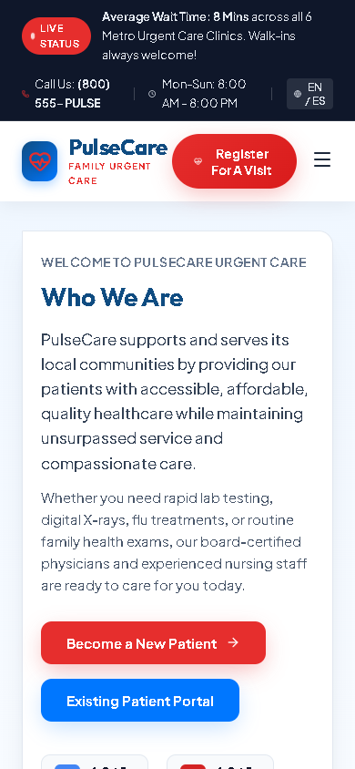

# PulseCare Urgent Care

PulseCare is a responsive healthcare website concept that organizes services, locations, billing guidance, patient resources, reviews, and visit registration into one consistent React interface.

> Portfolio concept: PulseCare is fictional. It does not provide medical services or advice, and its forms must not be used for real patient information.

## Project overview

**Goal:** Make common urgent-care decisions easy to find without overwhelming the visitor.

**My role:** Interface design, React implementation, responsive styling, interaction states, accessibility details, and repository documentation.

**Outcome:** A multi-view front-end demonstration with reusable content sections, clinic discovery, and a simulated registration journey.

## Screenshots

| Desktop | Mobile |
| --- | --- |
|  |  |

## Key functionality

- Home, locations, billing, records, events, reviews, and provider-information views
- Searchable clinic-location experience
- Simulated visit-registration form with confirmation state
- Reusable navigation, service, trust, testimonial, and form components
- Responsive layouts for desktop, tablet, and mobile screens
- Semantic form controls with descriptive labeling and clearly communicated validation and confirmation states

## Architecture and decisions

- `App.jsx` owns the current view and registration-dialog state.
- Page components separate each information journey while shared components keep navigation and calls to action consistent.
- The registration flow is deliberately simulated; no personal information is transmitted or stored.
- CSS breakpoints preserve content priority rather than simply shrinking the desktop layout.

## Technology

- React 19
- Vite
- JavaScript
- CSS
- Lucide React icons
- Oxlint and Node test runner

## Run locally

```bash
npm install
npm run dev
```

## Quality checks

```bash
npm run lint
npm test
npm run build
```

GitHub Actions runs the same checks for every pushed branch and pull request.

## Limitations

- No real clinic search, scheduling, authentication, or medical-record integration
- Form submission is a local demonstration only
- Demonstration content should not be treated as medical guidance

## Assets and reuse

See [ASSETS.md](ASSETS.md) for asset notes and [LICENSE](LICENSE) for reuse terms.
