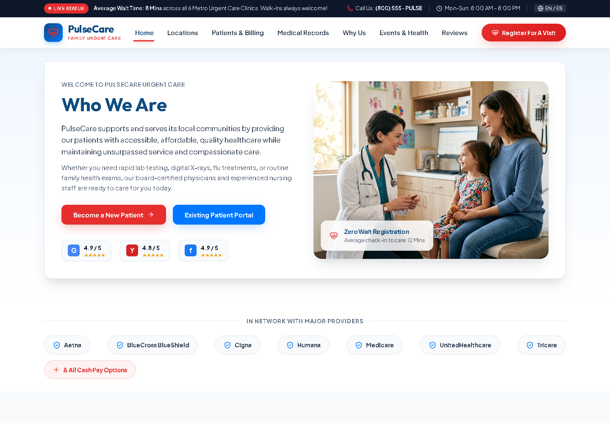
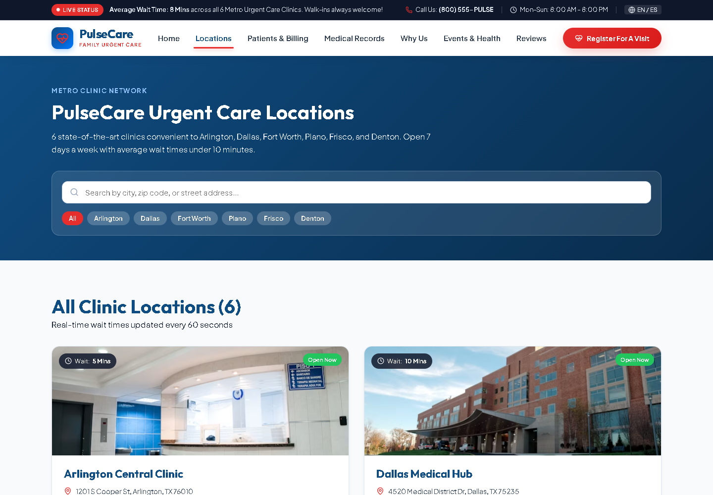

# PulseCare

**A calm, structured urgent-care experience for finding services and preparing for a visit.**

---

## Product story

PulseCare explores how a healthcare website can make information-heavy decisions feel clear and approachable. Services, clinic discovery, billing guidance, patient resources, and visit registration are organized into one consistent desktop experience.

| Focus | Contribution | Result |
| --- | --- | --- |
| Clear urgent-care navigation | Product interface design, React implementation, interaction states, accessibility, and documentation | A cohesive multi-view front-end demonstration with reusable patterns and a simulated registration journey |

## Interface preview

| Homepage | Clinic locations |
| --- | --- |
|  |  |

## Experience highlights

- Seven connected views covering services, locations, billing, records, events, reviews, and provider information
- Searchable clinic discovery designed for quick scanning
- Simulated visit-registration flow with clear validation and confirmation states
- Reusable navigation, service, trust, testimonial, and form components
- Semantic controls and descriptive labels throughout the main journeys
- A desktop layout that keeps important actions visible without crowding the interface

## Design and engineering

- <code>App.jsx</code> coordinates the active view and registration-dialog state.
- Page-level components separate each information journey.
- Shared components preserve consistency across navigation and calls to action.
- The registration experience remains a safe local simulation; no personal information is transmitted or stored.

## Technology

React 19 · Vite · JavaScript · CSS · Lucide React · Oxlint · Node test runner

## Run locally

~~~bash
npm install
npm run dev
~~~

## Quality checks

~~~bash
npm run lint
npm test
npm run build
~~~

GitHub Actions runs the same checks for every pushed branch and pull request.

## Project note

> PulseCare is a fictional portfolio concept. It does not provide medical services or advice, and its forms must not be used for real patient information.

## Assets and usage

See [ASSETS.md](ASSETS.md) for asset notes and [LICENSE](LICENSE) for reuse terms.
